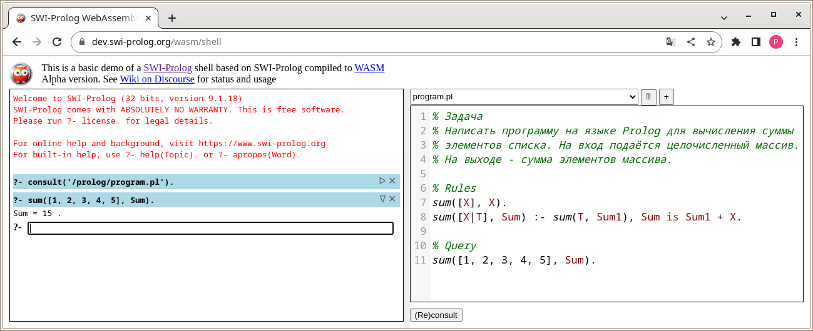

# Семинар №5 модуля "Парадигмы программирования и языки парадигм"

## Задача

* Написать программу на языке Prolog для вычисления суммы элементов списка. На вход подаётся целочисленный массив. На выходе - сумма элементов массива.

Программу я написал и проверил на [сайте online компилятора языка Prolog](https://dev.swi-prolog.org/wasm/shell)

Программа считает сумму всех элементов списка [1, 2, 3, 4, 5]. Если сложить 1 + 2 + 3 + 4 + 5 то должно получиться 15. Программа считает правильно, получается как раз 15.

Вывод программы таков:

